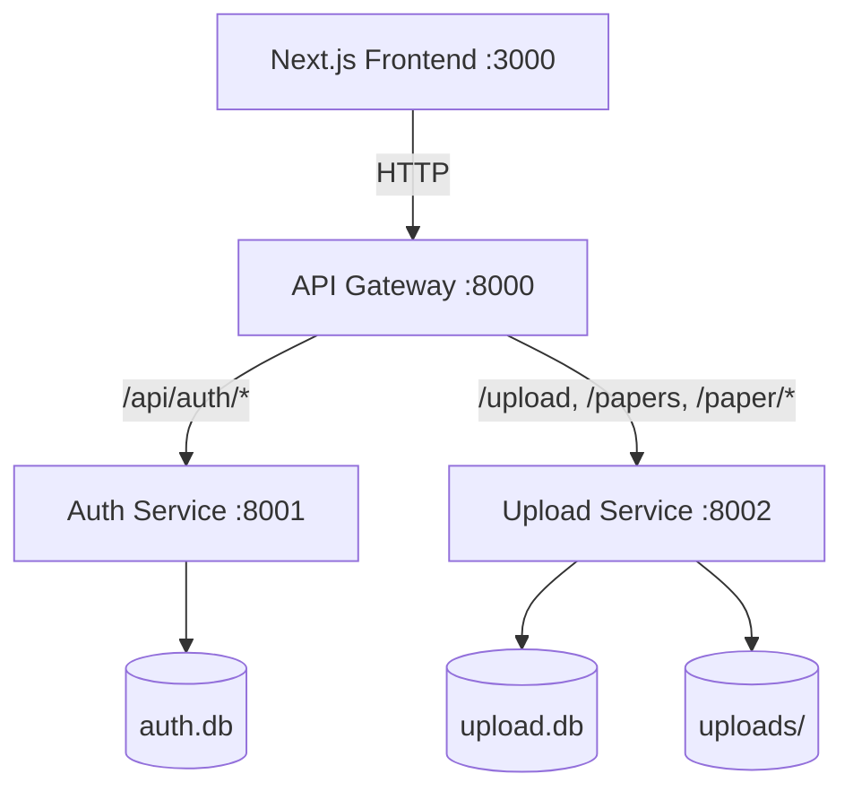
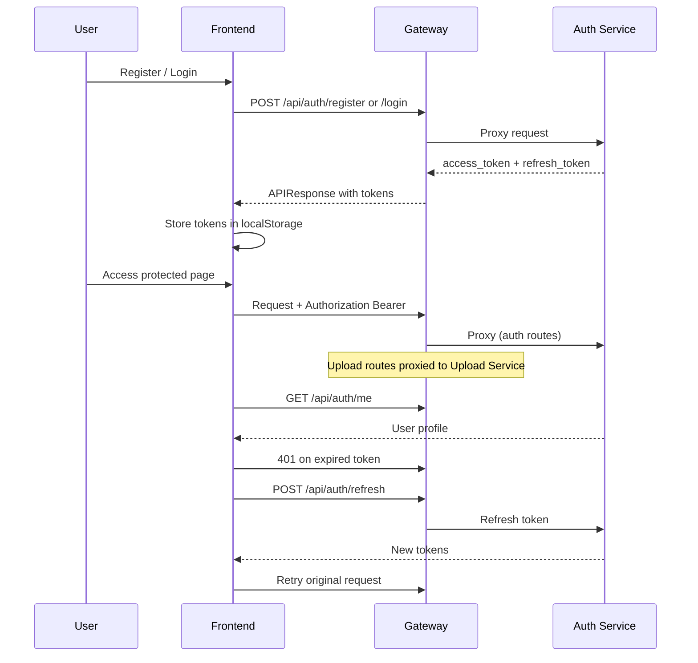

# AI Research Paper Assistant

A microservices-based platform for uploading, managing, and (future) analyzing PDF research papers with AI.

## Project Overview

This repository implements an AI Research Paper Assistant using a **microservices architecture** with a FastAPI backend, API Gateway, and Next.js frontend. Users authenticate via JWT, upload PDF papers, and manage their personal paper library.

**Current status:**
- Authentication service — implemented and tested
- Upload service — implemented and tested
- Parser service — implemented and tested
- API Gateway — implemented
- Frontend — minimal auth + upload + parse UI for integration testing

## Goals

1. Provide secure user authentication (register, login, JWT, refresh tokens)
2. Allow authenticated users to upload and manage PDF research papers
3. Establish a scalable microservices foundation for future AI features
4. Maintain consistent API contracts, logging, and test coverage

## Architecture Diagram



## Tech Stack

| Layer | Technology |
|-------|------------|
| Frontend | Next.js 16, React 19, TypeScript, Zustand, Tailwind CSS |
| API Gateway | FastAPI, httpx |
| Auth Service | FastAPI, SQLAlchemy, bcrypt, python-jose |
| Upload Service | FastAPI, SQLAlchemy, python-multipart |
| Database | SQLite (dev), PostgreSQL-ready via `DATABASE_URL` |
| Testing | pytest, FastAPI TestClient |
| Containers | Docker, Docker Compose |

## Folder Structure

```
.
├── backend/
│   ├── gateway/                 # API Gateway (port 8000)
│   │   └── main.py
│   ├── services/
│   │   ├── auth_service/        # Authentication (port 8001)
│   │   │   ├── main.py
│   │   │   ├── routers.py
│   │   │   ├── services.py
│   │   │   ├── models.py
│   │   │   ├── schemas.py
│   │   │   └── config.py
│   │   └── upload_service/      # PDF upload (port 8002)
│   │       ├── main.py
│   │       ├── routers.py
│   │       ├── services.py
│   │       ├── models.py
│   │       ├── schemas.py
│   │       └── config.py
│   └── shared/                  # Shared utilities
│       ├── auth.py              # JWT + password hashing
│       ├── schemas.py           # APIResponse, APIError
│       └── logger.py
├── frontend/
│   └── src/
│       ├── api/                 # auth.ts, upload.ts
│       ├── app/                 # Next.js App Router pages
│       ├── components/
│       └── store/               # Zustand auth store
├── tests/
│   ├── conftest.py
│   ├── test_auth.py
│   └── test_upload.py
├── docker/
│   ├── gateway.Dockerfile
│   ├── auth_service.Dockerfile
│   └── upload_service.Dockerfile
├── docker-compose.yml
├── requirements.txt
├── pytest.ini
└── .env.example
```

## Backend Services

### Auth Service (`:8001`)

| Method | Endpoint | Description |
|--------|----------|-------------|
| GET | `/health` | Health check |
| POST | `/api/auth/register` | Register new user |
| POST | `/api/auth/login` | Login |
| POST | `/api/auth/refresh` | Refresh JWT tokens |
| GET | `/api/auth/me` | Get current user (protected) |

### Upload Service (`:8002`)

| Method | Endpoint | Description |
|--------|----------|-------------|
| GET | `/health` | Health check |
| POST | `/upload` | Upload PDF (protected) |
| GET | `/papers` | List user's papers (protected) |
| DELETE | `/paper/{id}` | Delete paper (protected) |

### Parser Service (`:8003`)

| Method | Endpoint | Description |
|--------|----------|-------------|
| GET | `/health` | Health check |
| POST | `/parse` | Parse uploaded PDF by `paper_id` (protected) |

Request body: `{ "paper_id": 1 }`

### API Gateway (`:8000`)

Routes all client requests to the appropriate microservice. Enforces `Authorization` header on protected routes (`/upload`, `/papers`, `/paper/*`, `/parse`).

## Frontend Structure

| Route | Purpose |
|-------|---------|
| `/` | Home with navigation links |
| `/login` | Login form |
| `/register` | Registration form |
| `/dashboard` | Protected user profile view |
| `/upload` | PDF upload + papers list |

**State:** Zustand store (`src/store/auth.ts`) with localStorage token persistence.

**API client:** Native `fetch` with automatic token refresh (`src/api/auth.ts`).

## Authentication Flow



**JWT details:**
- Access token: 30 minutes, type `access`
- Refresh token: 7 days, type `refresh`
- Algorithm: HS256
- Secret: `JWT_SECRET_KEY` env var (must match across all services)

## API Flow

1. Frontend sends all requests to `http://localhost:8000` (gateway)
2. Gateway routes by path prefix:
   - `/api/auth/*` → Auth Service
   - `/upload`, `/papers`, `/paper/*` → Upload Service
   - `/parse` → Parser Service
   - `/health` → Auth Service
3. Upload and Parser services validate JWT via shared `get_current_user` dependency
4. All successful responses use `APIResponse` format:

```json
{
  "status": "success",
  "message": "Human-readable message",
  "data": { }
}
```

## Development Workflow

1. **Understand** — Read this README and service code
2. **Document** — Update README when adding services
3. **Verify** — Inspect integration points
4. **Test** — Write/run pytest tests before and after changes
5. **Fix** — Address failing tests and bugs
6. **Implement** — Follow existing service patterns
7. **Test again** — Ensure all tests pass

## Docker Usage

```bash
# Copy environment file
cp .env.example .env

# Build and start all services
docker compose up --build

# Services available:
# - Gateway:  http://localhost:8000
# - Auth:     http://localhost:8001
# - Upload:   http://localhost:8002
```

## Local Development

### Prerequisites

- Python 3.12+
- Node.js 20+
- pip

### Backend Setup

```bash
# From project root — recommended (single server, auth + upload + parser on :8000)
pip install -r requirements.txt
cp .env.example .env
python -m uvicorn backend.dev_server:app --reload --port 8000

# Or use the helper script (Windows)
# scripts\start-backend.ps1
```

**Important:** Use `backend.dev_server` on port **8000**, not `auth_service` alone.
Auth-only mode does not include `/upload` or `/parse` and will return 404.

### Full microservices mode (optional)

```bash
# Terminal 1 — Auth Service
python -m uvicorn backend.services.auth_service.main:app --reload --port 8001

# Terminal 2 — Upload Service
python -m uvicorn backend.services.upload_service.main:app --reload --port 8002

# Terminal 3 — Parser Service
python -m uvicorn backend.services.parser_service.main:app --reload --port 8003

# Terminal 4 — API Gateway
python -m uvicorn backend.gateway.main:app --reload --port 8000
```

### Frontend Setup

```bash
cd frontend
npm install
npm run dev
# Open http://localhost:3000
```

Set `NEXT_PUBLIC_API_URL=http://localhost:8000` in `frontend/.env.local` if needed.

## Running Tests

```bash
# From project root
pip install -r requirements.txt
pytest tests/ -v
```

**Test coverage includes:**
- Auth: register, login, JWT, refresh, `/me`, password hashing, validation
- Upload: PDF validation, size limits, CRUD, authorization, response format
- Parser: PDF parsing, metadata extraction, ownership, error handling

## Coding Standards

- **Thin routers** — HTTP layer only; business logic in `services.py`
- **Pydantic schemas** — All request/response validation
- **Shared utilities** — Reuse `backend/shared/` for auth, logging, response format
- **Structured logging** — Use `get_logger()` with request IDs
- **Error handling** — `HTTPException` for expected errors; global handler for 500s
- **Minimal scope** — Match existing patterns; avoid over-engineering

## Naming Conventions

| Item | Convention | Example |
|------|------------|---------|
| Services | `{name}_service` | `auth_service`, `upload_service` |
| Service directory | `backend/services/{name}_service/` | |
| Router prefix | Domain-based | `/api/auth`, `/upload` |
| DB models | PascalCase singular | `User`, `Paper` |
| API responses | `APIResponse` wrapper | `{ status, message, data }` |
| Env vars | `SCREAMING_SNAKE_CASE` | `JWT_SECRET_KEY` |
| Tests | `test_{feature}.py` | `test_auth.py` |
| Frontend API | `{domain}.ts` | `auth.ts`, `upload.ts` |

## Adding New Services

1. Create `backend/services/{name}_service/` with `main.py`, `routers.py`, `services.py`, `models.py`, `schemas.py`, `config.py`
2. Add shared auth dependency for protected routes
3. Register routes in `backend/gateway/main.py`
4. Add Dockerfile in `docker/`
5. Add service to `docker-compose.yml`
6. Add tests in `tests/test_{name}.py`
7. Update this README

## Future Roadmap

Per the product plan, upcoming features:

1. **Paper Processing** — Extract text/metadata from uploaded PDFs
2. **AI Chat** — Ask questions about uploaded papers
3. **Summaries & Reports** — Generate summaries, quizzes, citations
4. **PostgreSQL** — Production database migration
5. **Refresh token storage** — Server-side token revocation
6. **Role-based access** — Admin vs user permissions

---

**Next feature after Parser:** Text chunking / embedding service for AI chat (per PRD).
